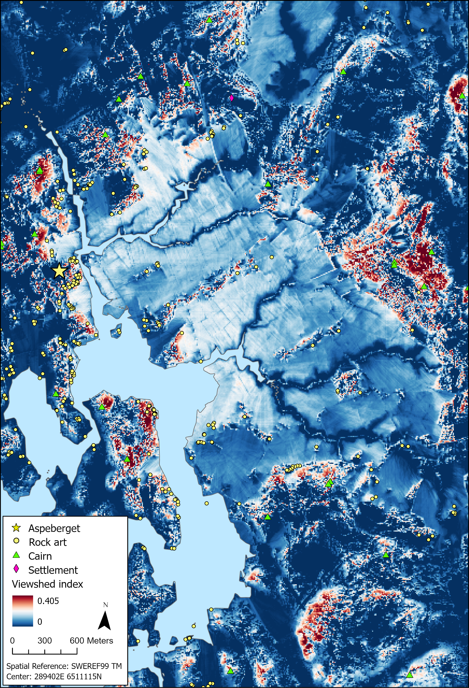

::: callout-note
This notebook was executed with R v`r getRversion()`
:::

## Introduction

This document provides the supplemental Information accompanying Chapter 5 of the book "[Masters of Water and Stone. Exploring the Role of Rock Art Carvers in Nordic Bronze Age Societies](https://www.oxbowbooks.com/9798888573044/masters-of-water-and-stone/)". All data required to reproduce the main analyses is available in the Zenodo repository that includes this markdown document.

::: callout-important
Python code shown here is not executable. It is reproduced for the sole purpose of showing the parameters used in Arcgis Pro for analysis.

Maps were created using elevation data from Lantmäteriet which is not open source. To obtain elevation data use SLU [search service](https://service.seamlessaccess.org/ds/?entityID=https%3A%2F%2Fmaps.slu.se%2Fshibboleth&return=https%3A%2F%2Fmaps.slu.se%2FShibboleth.sso%2FLogin%3FSAMLDS%3D1%26target%3Dss%253Amem%253Aa53c519fbacb5a0e27d7b896c970c2caca81513b4aa7e7e141b256581976b1f8).
:::

For more information about the research questions and rationale behind these analyses, as well as the interpretation of the results, please read the book.

## Directory and libraries

The following code loads and install, if necessary, all packages used in the script on the date they were last used to ensure reproducibility.

- `here` and `groundhog` are used for reproducibility

::: callout-tip
The package `groundhog` must be installed before executing the notebook. The function `groundhog.library` must be executed twice: one time to install packages, and another time to load them. To load the packages in the the current date run `lapply(pkgs, library, character.only=TRUE)` instead.
:::

- `readr` and `sf` are used to read .csv and .shp files

- `dplyr`, `forcats`, `magrittr`, `reshape`, `tibble`, and `tidyr` are used for data cleaning and exploratory data analysis

- `ggdist`, `ggplot2`, `ggpubr`, `ggrepel`, `ggtext`, `grid`, `gridExtra`, `scales` are used for plotting

- `knitr` and `rmarkdown` are used to produce the notebook

```{r}
#| label: packages
#| message: false
#| warning: false

# Clean environment
rm(list=ls())

# Required packages¨
pkgs <- c("dplyr", "forcats", "ggdist", "ggplot2", "ggpubr", "ggrepel", "ggtext", "grid", "gridExtra", "here", "knitr", "magrittr", "readr", "reshape2", "scales", "sf", "tibble", "tidyr", "rmarkdown")

# Load packages on date of use (and install if necessary)
require("groundhog")
groundhog.library(pkgs, "2025-10-1")

# Setting directory
here::i_am("scripts/First-the-rock-then-the-art.qmd")
```

## Datasets

The data used in this script come from two shapefiles and three CSV files. `BohuslanPanels.shp` is a multipoint feature that includes every panel in western Bohuslän and the frequency of figure types, as registered in [Förnsok](https://app.raa.se/open/fornsok/) by October 2023. `AspebergetMotifs.shp` is a multipolygon feature that includes every figure at Aspeberget, annotated with information on type, size, depth, chronology, etc. `PanelRockFeatures.csv` contains topographical information for panels at Aspeberget, obtained in ArcGIS Pro (v3.3.3). `MotifsRockFeatures.csv` contains topographical information for figures at Aspeberget, obtained in ArcGIS Pro (v3.3.3). `ObserverFrequencyAspeberget.csv` contains the output of the inverse viewshed analysis conducted in ArcGIS Pro (v3.3.3).

```{r}
#| label: import
#| message: false
#| warning: false

# Load Aspeberget's figures 
aspe_figures <- st_read(here("data/shp/AspebergetFigures.shp"))

# Tidy format for aspe_figures
aspe_long <- aspe_figures %>% 
    st_set_geometry(NULL) %>% #removing geometry for manipulation
    mutate(across(Volume:Direction, as.numeric)) %>% 
    rename("Directionality" = Direction,
           "Orientation" = Orient)

# Load topographical features for panels (Size, Dispersion, and Orientation)
panels_rock_features <- read_csv(here("data/csv/PanelRockFeatures.csv"))

# Load topographical features for motifs (Slope, Aspec, TWI, VRM, Altitude)
motifs_rock_features <- aspe_figures %>% 
    st_drop_geometry() %>% 
    left_join(read_csv(here("data/csv/MotifsRockFeatures.csv")))

# Aspeberget panels RAÅ numbers and Lämningsnummers for filtering
aspeberget_panels <- c("Tanum 12:1","Tanum 13:1","Tanum 14:1","Tanum 14:2","Tanum 15:1","Tanum 16:1","Tanum 16:2","Tanum 17:1","Tanum 17:2","Tanum 18:1","Tanum 19:1","Tanum 21:1","Tanum 22:1","Tanum 23:1","Tanum 24:1","Tanum 25:1","Tanum 26:1","Tanum 28:1","Tanum 29:1","Tanum 84:1","Tanum 119:1","Tanum 119:2","Tanum 120:1","Tanum 129:1","Tanum 883:1","Tanum 2338","Tanum 2345", "L1968:7148", "L1968:7560", "L1968:7670", "L1968:7449", "L1968:7552", "L1968:7101", "L1968:7660", "L1968:7160", "L1968:7850", "L1967:2415", "L1968:7302", "L1968:7401", "L1968:7497", "L1968:7505", "L1968:7603", "L1968:7610", "L1968:7752", "L1968:7805", "L1968:7305", "L1968:7666", "L1968:7663", "L1968:7443", "L1968:7758", "L1968:7456", "L1967:3416", "L1959:2584", "L1959:2719")
```

## Topographic analysis of panels

To determine what drove carvers to select particular rocks, seven metrics are calculated: size, dispersion, slope, Vector Ruggedness Measurement (VRM), orientation, directionality, and Topographic Wetness Index (TWI). All raster analyses were performed on a 0.5-meter-resolution DEM interpolated from LIDAR data generated by Lantmäteriet (2022). All analyses were performed in ArcGIS Pro (v3.3.3).

### Size

Defining the natural boundaries of a panel presents significant challenges. In many cases, the limits observed in the field are the result of artificial delimitations introduced during excavation or documentation. To ensure a more objective and reproducible approach, the size of each panel was determined based on the spatial extent and dispersion of the figures.

#### Convex hull

The spatial extent of a panel is defined as the [Minimum Bounding Geometry](https://pro.arcgis.com/en/pro-app/latest/tool-reference/data-management/minimum-bounding-geometry.htm) (convex hull) enclosing the figures of such panel. It was calculated in ArcGIS Pro (v3.3.3).

``` python
arcpy.management.MinimumBoundingGeometry(
    in_features="AspebergetMotifs",
    out_feature_class=r"C:/Users/Julian Moyano/Documents/ArcGIS/Projects/Aspebegert rock features/aspebegert rock features.gdb/Aspe_Panels_ConvexH",
    geometry_type="CONVEX_HULL",
    group_option="LIST",
    group_field="RAA",
    mbg_fields_option="MBG_FIELDS"
)
```

#### Dispersion

Figure dispersion within a panel is calculated using [Standard Distance](https://pro.arcgis.com/en/pro-app/latest/tool-reference/spatial-statistics/standard-distance.htm#:~:text=The%20Standard%20Distance%20tool%20creates,equal%20to%20the%20standard%20distance.) in ArcGIS Pro (v3.3.3). This technique quantifies how features are concentrated or spread out around their geometric mean center, providing a quantitative measure of spatial dispersion.

``` python
arcpy.stats.StandardDistance(
    Input_Feature_Class="AspebergetMots_Point",
    Output_Standard_Distance_Feature_Class=r"C:/Users/Julian Moyano/Documents/ArcGIS/Projects/Aspebegert rock features/aspebegert rock features.gdb/AspeMotifs_StandardDistance",
    Circle_Size="1_STANDARD_DEVIATION",
    Weight_Field=None,
    Case_Field="RAA"
)
```

### Slope

Slope was calculated in degrees using the [Surface Parameters](https://pro.arcgis.com/en/pro-app/3.1/tool-reference/spatial-analyst/surface-parameters.htm) tool in ArcGIS Pro (v3.3.3). The [Slope](https://pro.arcgis.com/en/pro-app/latest/tool-reference/spatial-analyst/how-surface-parameters-works.htm) surface parameter represents the steepness at each cell of a raster surface. The lower the slope value, the flatter the terrain; the higher the slope value, the steeper the terrain.

``` python
arcpy.ddd.SurfaceParameters(
    in_raster=r"Rasters/DEM/Aspe_DEM_0_5",
    out_raster=r"C:/Users/Julian Moyano/Documents/ArcGIS/Projects/Aspebegert rock features/Aspebegert rock features.gdb/Aspe_Slope2",
    parameter_type="SLOPE",
    local_surface_type="QUADRATIC",
    neighborhood_distance="0.5 Meters",
    use_adaptive_neighborhood="FIXED_NEIGHBORHOOD",
    z_unit="METER",
    output_slope_measurement="DEGREE",
    project_geodesic_azimuths="GEODESIC_AZIMUTHS",
    use_equatorial_aspect="NORTH_POLE_ASPECT",
    in_analysis_mask=r"Shape files/Aspe_Buffer_1km"
)
```

### Vector Ruggedness Measurement

Vector Ruggedness Measurement (VRM) was calculated using the [Arc Hydro toolbox](https://www.esri.com/en-us/industries/water-resources/arc-hydro) in ArcGIS Pro (v3.3.3). As stated by the authors of the package:

> *VRM provides a way to measure terrain ruggedness as the variation in three-dimensional orientation of grid cells within a neighborhood. Slope and aspect are captured into a single measure and used to decouple terrain ruggedness from just slope or elevation. The VRM was first proposed by Hobson (1972) in “Surface roughness in topography: quantitative approach” and was later adapted by Sappington et al (2007) in “Quantifying landscape ruggedness for animal habitat analysis: A case study using bighorn sheep in the Mojave Desert.” The tool script use geoprocessing workflows developed by Dr. Barry Nickel, a professor at University of California Santa Cruz.*

Note that the resolution at which this analysis has been conducted (0.5 m) may hinder the analysis of micro-relationships between the figures and certain features of the rock. However, field observations indicate that these relationships are not relevant to explaining why particular rocks were selected (see publication).

``` python
arcpy.ImportToolbox(r"C:/Users/Julian Moyano/Documents/ArcGIS/Projects/Aspebegert rock features/Aspebegert rock features.atbx")
arcpy.archydropro.vectorruggednessmeasurement(
    Input_Elevation_Raster=r"DEM/Aspe_LAS",
    Neighborhood_Distance="0.5 Meters",
    Window_Size=3,
    Output_Raster=r"C:/Users/Julian Moyano/Documents/ArcGIS/Projects/Aspebegert rock features/aspebegert rock features.gdb/Aspe_VRM"
)
```

### Aspect

To determine the general orientation of the rock surface where each panel was created, I used [Surface Parameters](https://pro.arcgis.com/en/pro-app/latest/tool-reference/spatial-analyst/surface-parameters.htm) in ArcGIS Pro (v3.3.3) to calculate the [Aspect](https://pro.arcgis.com/en/pro-app/latest/tool-reference/spatial-analyst/how-surface-parameters-works.htm) of each cell within the panel's convex hull. The Aspect surface parameter identifies the direction the downhill slope faces. Each cell in the output raster indicates the compass direction the surface faces at that location. It is measured clockwise in degrees from 0 (due north) to 360 (again due north), completing a full circle. Flat areas with no downslope direction are assigned a value of -1. After calculation, the values were summarized for each panel using [Zonal Statistics as Table](https://pro.arcgis.com/en/pro-app/latest/tool-reference/spatial-analyst/zonal-statistics-as-table.htm).

``` python
# Calculate Aspect
arcpy.ddd.SurfaceParameters(
    in_raster=r"Rasters/DEM/Aspe_DEM_0_5",
    out_raster=r"C:/Users/Julian Moyano/Documents/ArcGIS/Projects/Aspebegert rock features/Aspebegert rock features.gdb/Aspe_Aspect",
    parameter_type="ASPECT",
    local_surface_type="QUADRATIC",
    neighborhood_distance="0.5 Meters",
    use_adaptive_neighborhood="FIXED_NEIGHBORHOOD",
    z_unit="METER",
    output_slope_measurement="DEGREE",
    project_geodesic_azimuths="GEODESIC_AZIMUTHS",
    use_equatorial_aspect="NORTH_POLE_ASPECT",
    in_analysis_mask=r"Shape files/Aspe_Buffer_1km"
)

# Extractic summary statistics for each panel
arcpy.ia.ZonalStatisticsAsTable(
    in_zone_data=r"Shape files/Aspe_Panels_ConvexH",
    zone_field="RAA",
    in_value_raster=r"Rasters/Aspe_Aspect",
    out_table=r"C:/Users/Julian Moyano/Documents/ArcGIS/Projects/Aspebegert rock features/Aspebegert rock features.gdb/Aspe_Aspect_summary",
    ignore_nodata="DATA",
    statistics_type="ALL",
    process_as_multidimensional="CURRENT_SLICE",
    percentile_values=[90],
    percentile_interpolation_type="AUTO_DETECT",
    circular_calculation="CIRCULAR",
    circular_wrap_value=360,
    out_join_layer=None
)
```

### Orientation and directionality

Because the orientation and directionality of the figures cannot be consistently extracted through automated methods, these attributes were manually annotated. First, I created a [polyline feature](https://pro.arcgis.com/en/pro-app/latest/tool-reference/data-management/create-feature-class.htm) on top of each motif with start and end points that respected the figure's orientation and directionality. Only figures with clear orientation/directionality were annotated—for example, features like cupmarks have no orientation or direction for obvious reasons. Second, the orientation/directionality of the line was calculated using [Linear Directional Mean](https://pro.arcgis.com/en/pro-app/latest/tool-reference/spatial-statistics/linear-directional-mean.htm), which identifies the mean direction, length, and geographic center for a set of lines. The trend for a set of line features is measured by calculating the average angle of the lines. The statistic used to calculate the trend is known as the directional mean. While the statistic itself is termed the directional mean, it is used to measure either direction or orientation. Third, the orientation/directionality of the line was joined to the attributes of the figures using [Overlay Layers](https://pro.arcgis.com/en/pro-app/latest/tool-reference/feature-analysis/overlay-layers.htm). The analyses were conducted in ArcGIS Pro (v3.3.3).

``` python
# Example for Tanum 18:1

# Create line feature
arcpy.management.CreateFeatureclass(
    out_path=r"C:/Users/Julian Moyano/Dropbox (Inst. för historiska studier)/DIGARV Annotations/Tanum 18/Tanum 18.gdb",
    out_name="Orientation",
    geometry_type="POLYLINE",
    template=None,
    has_m="DISABLED",
    has_z="ENABLED",
    spatial_reference='PROJCS["SWEREF99_TM",GEOGCS["GCS_SWEREF99",DATUM["D_SWEREF99",SPHEROID["GRS_1980",6378137.0,298.257222101]],PRIMEM["Greenwich",0.0],UNIT["Degree",0.0174532925199433]],PROJECTION["Transverse_Mercator"],PARAMETER["False_Easting",500000.0],PARAMETER["False_Northing",0.0],PARAMETER["Central_Meridian",15.0],PARAMETER["Scale_Factor",0.9996],PARAMETER["Latitude_Of_Origin",0.0],UNIT["Meter",1.0]],VERTCS["unknown",VDATUM["unknown"],PARAMETER["Vertical_Shift",0.0],PARAMETER["Direction",1.0],UNIT["Meter",1.0]];-5120900 -9998100 10000;-100000 10000;-100000 10000;0.001;0.001;0.001;IsHighPrecision',
    config_keyword="",
    spatial_grid_1=0,
    spatial_grid_2=0,
    spatial_grid_3=0,
    out_alias=""
)

# Calcualte linear directional mean
arcpy.stats.DirectionalMean(
    Input_Feature_Class="Orientation",
    Output_Feature_Class=r"C:/Users/Julian Moyano/Dropbox (Inst. för historiska studier)/DIGARV Annotations/Tanum 18/Tanum 18.gdb/Orientation2",
    Orientation_Only="DIRECTION",
    Case_Field="CaseField"
)

# Join to figure attributes
arcpy.gapro.OverlayLayers(
    input_layer="Motifs",
    overlay_layer="Orientation",
    out_feature_class=r"C:/Users/Julian Moyano/Dropbox (Inst. för historiska studier)/DIGARV Annotations/Tanum 18/Tanum 18.gdb/OrientationMotifs",
    overlay_type="INTERSECT"
)
```

### Topographic Wetness Index

Topographic Wetness Index (TWI) was calculated using the [Arc Hydro toolbox](https://www.esri.com/en-us/industries/water-resources/arc-hydro) in ArcGIS Pro (v3.3.3). As explained by the authors of the package:

> *The TWI relates the tendency of an area to receive water to its tendency to drain water, and is defined as*
>
> $$TWI=ln(\frac{\alpha}{tan\beta}),$$
>
> *where* $\alpha$ *is the specific catchment area (contributing area per unit contour length) and* $tan(\beta)$ *is the local slope (Beven & Kirkby, 1979). The WIM implementation of eq (2) requires a TWI slope and specific catchment area as inputs, although both can be calculated directly from the input high-resolution DEM*.

``` python
arcpy.ImportToolbox(r"C:/Users/Julian Moyano/Documents/ArcGIS/Projects/Aspebegert rock features/Aspebegert rock features.atbx")
arcpy.archydropro.calculatetopographicwetnessindexsurfaceparameters(
    Input_Smoothed_DEM="Aspe_LAS",
    Hydrocondition_Method="Continuous Flow",
    Slope_Neighborhood_Distance=1,
    Output_TWI_Raster=r"C:/Users/Julian Moyano/Documents/ArcGIS/Projects/Aspebegert rock features/predictor_variables/Aspe_LAS_twi_SLP_an_10mMax_CF.tif",
    Save_Intermediate_Rasters=False,
    Output_TWI_Slope_Raster=r"C:/Users/Julian Moyano/Documents/ArcGIS/Projects/Aspebegert rock features/secondary_outputs/Aspe_LAS_SLP_an_10mMax.tif",
    Output_TWI_FAC_Raster=r"C:/Users/Julian Moyano/Documents/ArcGIS/Projects/Aspebegert rock features/secondary_outputs/Aspe_LAS_FAC_CF.tif",
    Input_TWI_Slope=None,
    Input_TWI_FAC_Raster=None
)
```

{fig-align="center" width="75%"}

## Comparison of panels

### Extraction of surface information at figure locations

To compare the geospatial properties of the panels, I extracted information from the generated rasters (slope, TWI, VRM, etc.) at each figure's location using the [Extract Multi Values to Points](https://pro.arcgis.com/en/pro-app/3.1/tool-reference/spatial-analyst/extract-multi-values-to-points.htm) tool in ArcGIS Pro (v3.3.3). Then, the values were grouped by RAA number in `PanelRockFeatures.csv`.

``` python
arcpy.sa.ExtractMultiValuesToPoints(
    in_point_features=r"Shape files/AspebergetMotifs_Point",
    in_rasters=r"Rasters/Aspe_Slope Slope;Rasters/Aspe_Aspect Aspect;'Rasters/Solar radiation/Aspe_Dir_Rad;Rasters/Aspe_VRM VRM;Rasters/Aspe_TWI.tif TWI",
    bilinear_interpolate_values="NONE"
)
```

### Exploratory data analysis of topographic features

Once all the features were extracted for each figure, I explored the distribution of these features by panel. To improve the readability of the plots, I filtered out panels with fewer than 10 observations and the panels Tanum 2345 and Tanum 29:1 because they have very low variability.

```{r}
#| label: exploration
#| message: false
#| warning: false
#| fig-width: 9
#| fig-height: 11


# Distribution slope
bp_slope <- motifs_rock_features %>%
    # Filtering out Tanum 2345 for lack of variability
    filter(!RAAnr == "Tanum 2345") %>%
    # Filtering panels with less than 10 motifs
    group_by(RAAnr) %>% 
    filter(n() > 9) %>% 
    mutate(total = n(), RAAnrN =  paste0(RAAnr, "\n(n=", total, ")")) %>%
    ungroup() %>% 
    ggplot(aes(x = fct_reorder(RAAnrN, Slope, .desc = T, .na_rm = T), y = Slope)) +
    geom_boxplot(color = "black",
                 fill = "darkgray") +
    stat_kruskal_test() +
    # Removing rightmost outliers in random group to improve plotting
    scale_y_continuous(limits = c(0, 35),
                       breaks = seq(0, 35, 5)) +
    labs(x = NULL,
         y = "Slope in degrees") +
    theme_linedraw() +
    theme(panel.grid = element_blank())


# Distribution VRM
bp_vrm <- motifs_rock_features %>%
    # Filtering out Tanum 2345 for lack of variability
    filter(!RAAnr == "Tanum 2345") %>% 
    # Filtering panels with less than 10 motifs
    group_by(RAAnr) %>% 
    filter(n() > 9) %>% 
    mutate(total = n(), RAAnrN =  paste0(RAAnr, "\n(n=", total, ")")) %>%
    ungroup() %>% 
    ggplot(aes(x = fct_reorder(RAAnrN, VRM, .desc = T, .na_rm = T), y = VRM)) +
    geom_boxplot(color = "black",
                 fill = "darkgray") +
    # Logarithmic scale to reduce outliers weigth
    scale_y_log10(label = label_log()) +
    stat_kruskal_test() +
    labs(x = NULL,
         y = "Vector Ruggedness Measurement index") +
    theme_linedraw() +
    theme(panel.grid = element_blank())


# Distribution TWI
bp_twi <- motifs_rock_features %>%
    # Filtering panels with less than 10 motifs
    group_by(RAAnr) %>% 
    filter(n() > 9) %>% 
    mutate(total = n(), RAAnrN =  paste0(RAAnr, "\n(n=", total, ")")) %>%
    ungroup() %>% 
    ggplot(aes(x = fct_reorder(RAAnrN, TWI, .desc = T, .na_rm = T), y = TWI)) +
    geom_boxplot(color = "black",
                 fill = "darkgray") +
    stat_kruskal_test() +
    # Removing rightmost outliers in random group to improve plotting
    scale_y_continuous(limits = c(0, 11),
                       breaks = seq(0, 11, 1)) +
    labs(x = NULL,
         y = "Topographic Wetness Index") +
    theme_linedraw() +
    theme(panel.grid = element_blank())

ggarrange(bp_vrm, bp_slope, bp_twi,
          ncol = 1, labels = "AUTO")
```

Next, I plot the orientation and directionality of the figures in relation with the general orientation of the rock surface (calculated as the average Aspect).

```{r}
#| label: orientation
#| message: false
#| warning: false
#| fig-width: 10
#| fig-height: 10

# Orientation by panel
aspe_figures %>% 
    # Removing panels without orientation information
    filter(Orient > 0) %>% 
    # Removing panels with less than three observations
    group_by(RAAnr) %>% 
    filter(n() > 3) %>%
    left_join(select(panels_rock_features, RAAnr, Aspect_mean)) %>% 
    ggplot(aes(x = Orient)) +
    geom_histogram(color = "gray40",
                   fill = "grey") +
    geom_vline(aes(xintercept = Aspect_mean),
               color = "black",
               linetype = 2,
               size = 0.75) +
    coord_polar() +
    scale_x_continuous(limits = c(0,359),
                     breaks = seq(0, 360, by = 45),
                     minor_breaks = seq(0, 360, by = 15),
                     labels = c("N", "NE", "E", "SE", "S", "SW", "W", "NW", "N")) +
    facet_wrap(vars(RAAnr), scales = "free") +
    labs(x = NULL,
         y = NULL) +
    theme_light() +
    theme(panel.grid.minor = element_blank(),
          axis.ticks = element_line(color = "black"),
          axis.text.x = element_text(color = "black"), 
          axis.text.y = element_text(color = "black"),
          panel.border = element_rect(color = "black"),
          strip.text = element_text(color = "grey5"),
          strip.background = element_rect(color = "black"))

# Directionality by panel
aspe_figures %>% 
    # Removing panels without directionality information
    filter(Direction > 0) %>% 
    # Removing panels with less than three observations
    group_by(RAAnr) %>% 
    filter(n() > 3) %>%
    left_join(select(panels_rock_features, RAAnr, Aspect_mean)) %>% 
    ggplot(aes(x = Direction)) +
    geom_histogram(color = "gray40",
                   fill = "grey") +
    geom_vline(aes(xintercept = Aspect_mean),
               color = "black", linetype = 2, size = 0.75) +
    guides(fill = guide_legend(reverse = TRUE)) +
    coord_polar()+
    scale_x_continuous(limits = c(0,359),
                     breaks = seq(0, 360, by = 45),
                     minor_breaks = seq(0, 360, by = 15),
                     labels = c("N", "NE", "E", "SE", "S", "SW", "W", "NW", "N")) +
    facet_wrap(vars(RAAnr), scales = "free")+
    labs(x = NULL,
         y = NULL) +
    theme_light() +
    theme(axis.ticks = element_line(color = "black"),
          axis.text.x = element_text(color = "black"), 
          axis.text.y = element_text(color = "black"),
          panel.border = element_rect(color = "black"),
          strip.text = element_text(color = "grey5"),
          strip.background = element_rect(color = "black"))
```

## Viewshed analysis

The visibility study comprises four analyses: cumulative viewshed, inverse viewshed, fuzzy viewshed, and total viewshed. All analyses were performed in ArcGIS Pro (v. 3.3.3) using the [Geodesic Viewshed](https://pro.arcgis.com/en/pro-app/latest/tool-reference/spatial-analyst/viewshed-2.htm) tool in ArcGIS Pro (v3.3.3), which accounts for Earth's curvature and provides more accurate visibility modeling over varying distances. The raster used was a DEM (10 m) interpolated to eliminate modern features such as roads. Because the landscape changed with shore displacement, the altitude values calculated would have been lower in the Bronze Age. Unfortunately, reconstructing the paleolandscape at the resolution needed to perform this analysis was not possible. Therefore, the analysis was performed with modern elevation data, and the shoreline of the period is shown as a reference.

The observer points were set at the centroid of each panel and can be found in the file `AspebergetPanelsPoint.shp`. In every case, the observer height was set to 1.7 meters, and the radius of the analysis was limited to 5 km.

### Cumulative viewshed

The cumulative viewshed is the sum of individual binary viewsheds—in this case, from the 27 panels at Aspeberget[^1]. Each viewshed map assigns 0 to cells that are not visible and 1 to cells that are visible from a given viewpoint. When these binary rasters are summed, the result shows how many times each cell is visible across all panels. This calculation was performed using the "Frequency" analysis type in the [Geodesic Viewshed](https://pro.arcgis.com/en/pro-app/latest/tool-reference/spatial-analyst/viewshed-2.htm) tool.

[^1]: If viewshed is instead  calculated from the highest point of the hill, the cumulative viewshed remains essentially the same.

``` python
with arcpy.EnvManager(scratchWorkspace=r"C:/Users/Julian Moyano/Documents/ArcGIS/Projects/Aspebegert rock features/Aspebegert rock features.gdb"):
    out_raster = arcpy.sa.Viewshed2(
        in_raster=r"Shorelines/Con_Minus_Spline_LingCorrection_BP3700.tif",
        in_observer_features=r"Shape files/Aspe_Panels_Point",
        out_agl_raster=None,
        analysis_type="FREQUENCY",
        vertical_error="0 Meters",
        out_observer_region_relationship_table=None,
        refractivity_coefficient=0.13,
        surface_offset="0 Meters",
        observer_elevation=None,
        observer_offset="1.7 Meters",
        inner_radius=None,
        inner_radius_is_3d="GROUND",
        outer_radius="5 Kilometers",
        outer_radius_is_3d="GROUND",
        horizontal_start_angle=0,
        horizontal_end_angle=360,
        vertical_upper_angle=90,
        vertical_lower_angle=-90,
        analysis_method="ALL_SIGHTLINES",
        analysis_target_device="GPU_THEN_CPU"
    )
    out_raster.save(r"C:/Users/Julian Moyano/Documents/ArcGIS/Projects/Aspebegert rock features/Aspebegert rock features.gdb/Cum_Viewshed_BAI")
```

{fig-align="center" width="75%"}

### Reverse viewshed

The reverse viewshed analysis evaluates the visibility of specific locations from the surrounding landscape. Unlike traditional viewshed analysis, which identifies what is visible from a given point, the reverse approach determines which *observer* points are visible from each *raster cell*. The analysis was conducted using the "Observer" method in the [Geodesic Viewshed](https://pro.arcgis.com/en/pro-app/latest/tool-reference/spatial-analyst/viewshed-2.htm) tool.

``` python
with arcpy.EnvManager(scratchWorkspace=r"C:/Users/Julian Moyano/Documents/ArcGIS/Projects/Aspebegert rock features/Aspebegert rock features.gdb"):
    out_raster = arcpy.sa.Viewshed2(
        in_raster=r"Shorelines/Con_Minus_Spline_LingCorrection_BP3700.tif",
        in_observer_features=r"Shape files/Aspe_Panels_Point",
        out_agl_raster=None,
        analysis_type="OBSERVERS",
        vertical_error="0 Meters",
        out_observer_region_relationship_table=r"C:/Users/Julian Moyano/Documents/ArcGIS/Projects/Aspebegert rock features/Aspebegert rock features.gdb/Rev_View_BAI_Tab",
        refractivity_coefficient=0.13,
        surface_offset="1.7 Meters",
        observer_elevation=None,
        observer_offset="0 Meters",
        inner_radius=None,
        inner_radius_is_3d="GROUND",
        outer_radius="5 Kilometers",
        outer_radius_is_3d="GROUND",
        horizontal_start_angle=0,
        horizontal_end_angle=360,
        vertical_upper_angle=90,
        vertical_lower_angle=-90,
        analysis_method="ALL_SIGHTLINES",
        analysis_target_device="GPU_THEN_CPU"
    )
    out_raster.save(r"C:/Users/Julian Moyano/Documents/ArcGIS/Projects/Aspebegert rock features/Aspebegert rock features.gdb/Rev_View_BAI")
```

### Fuzzy viewshed

Human visibility can be affected by both physical and environmental factors, and it has been argued that viewshed analyses should incorporate distance decay functions (Fisher 1994). However, these functions account for distance and environmental conditions but do not consider the visual properties of the carvings or the specific landscape characteristics of Tanum.

To address this limitation, I conducted field observations at panels that allowed walking approach from long distances. The aim was to assess how visible the figures are as one approaches the panel. Two main challenges emerged: first, the landscape in Tanum has changed significantly, and vegetation now obstructs access to some panels; second, the figures no longer appear as they did when freshly carved during the Bronze Age. Fresh carvings would have exhibited higher contrast against the rock surface, enhancing their visibility.

To mitigate these issues, I walked towards the panels Tanum 12:1 and Foss 6:1, documenting changes in panel visibility and figure clarity as I moved closer. The fact that Tanum 12:1 is painted and that the figures on Foss 6:1 are unusually deep may help simulate the appearance of a freshly carved panel. The results show that figure details are only recognizable at very short distances, and identifying the panel becomes increasingly difficult as one moves away. Based on these field observations, I defined visual quality using the criteria established by Barnett et al. (2024), with some modifications::

| Range | Distance | Characterization |
|------------------------|------------------------|------------------------|
| Observation | 10 | It is possible to observe the hill but the detection of individual panels is not possible |
| Detection | 50 | Potential detection of panels but the recognition of motifs is not possible |
| Recognition | 75 | Potential recognition of motifs and geological features but not of details |
| Identification | 500 | Potential identification of details in the motifs and the rock |

Using these distance ranges, I reclassified the binary viewshed performed above:

1.  Convert the viewshed [raster to polygon](https://pro.arcgis.com/en/pro-app/3.4/tool-reference/data-management/feature-to-polygon.htm). Merge the polygons.

``` python
with arcpy.EnvManager(outputZFlag="Disabled", outputMFlag="Disabled"):
    arcpy.conversion.RasterToPolygon(
        in_raster="Rev_Viewshed_All",
        out_polygon_features=r"C:/Users/Julian Moyano/Desktop/Aspeberget visibility/Aspeberget visibility.gdb/RasterT_Rev_Vie1",
        simplify="SIMPLIFY",
        raster_field="Value",
        create_multipart_features="SINGLE_OUTER_PART",
        max_vertices_per_feature=None
    )
```

2.  Calculate the [mean center](https://pro.arcgis.com/en/pro-app/3.4/tool-reference/spatial-statistics/mean-center.htm) of panels at Aspeberget.

``` python
arcpy.stats.MeanCenter(
    Input_Feature_Class=r"Panels/AspebergetPanels",
    Output_Feature_Class=r"C:/Users/Julian Moyano/Desktop/Aspeberget visibility/Aspeberget visibility.gdb/AspebergetPanels_MeanCenter",
    Weight_Field=None,
    Case_Field=None,
    Dimension_Field=None
)
```

3.  Crate [mutiple buffers](https://pro.arcgis.com/en/pro-app/latest/tool-reference/analysis/multiple-ring-buffer.htm) according to distances ranges proposed above.

``` python
arcpy.analysis.MultipleRingBuffer(
    Input_Features=r"Panels/AspebergetPanels",
    Output_Feature_class=r"C:/Users/Julian Moyano/Desktop/Aspeberget visibility/Aspeberget visibility.gdb/AspebergetMultipleRingBuffer",
    Distances=[10,50,75,150,500],
    Buffer_Unit="Default",
    Field_Name="distance",
    Dissolve_Option="ALL",
    Outside_Polygons_Only="FULL",
    Method="GEODESIC"
)
```

4.  Clip the raster with the buffers using [Pairwise clip](https://pro.arcgis.com/en/pro-app/latest/tool-reference/analysis/pairwise-clip.htm).

``` python
arcpy.analysis.PairwiseClip(
    in_features="AspebergetMultipleRingBuffer",
    clip_features="RasterT_Rev_Vie1",
    out_feature_class=r"C:/Users/Julian Moyano/Desktop/Aspeberget visibility/Aspeberget visibility.gdb/AspebergetMulti_PairwiseClip",
    cluster_tolerance=None
)
```

{fig-align="center" width="75%"}

### Total viewshed

Total viewsheds represent the visual properties inherent in a landscape, based on its topography. They are generated by summing individual viewsheds created from all cells—each representing a potential viewpoint—in a digital elevation model (DEM). In this case, the total viewshed illustrates how visible the area is relative to its surroundings and may help explain why the hill was selected as a location for rock art. However, it has been argued that a limitation of total viewshed analysis is its failure to account for the characteristics of the immediate cells (Llobera 2001; Brughmans, van Garderen, and Gillings 2018). For instance, a location may be chosen not for its general visibility but for its visual prominence, or for its proximity to another highly visible feature.

While these considerations are important, they are not fully relevant to the present case study. First, as previously discussed, the panels at Tanum generally have low inclination and ruggedness, suggesting that visual prominence was not a significant factor in their placement. Second, the only documented features on the hill—namely, a burial ground—are not visually prominent and date to the Early Iron Age, so they lack a direct connection to the earliest carvings. Therefore, the analysis of visual prominence can be set aside.

Total viewshed was performed using the Visibility index from the plugin [Visibility Analysis](https://landscapearchaeology.org/qgis-visibility-analysis-manual/) (v1.5) in QGIS (v3.42) sampling 32 lines (Cuckovic 2016):

``` python
processing.run("visibility:visibilityindex", {'DEM':'C:/Users/Julian Moyano/Desktop/Intervisibility/tanum_las_10.tif','RADIUS':5000,'OBSERVER_HEIGHT':1.7,'TARGET_HEIGHT':0,'SAMPLE':2,'DIRECTION':0,'INTERPOLATE':True,'USE_CURVATURE':True,'REFRACTION':0.13,'OUTPUT':'TEMPORARY_OUTPUT'})
```

{fig-align="center" width="75%"}

## References

Barnett, T., Valdez-Tullett, J., Bjerketvedt, L. M., et al. 2024. “A Multiscalar Methodology for Holistic Analysis of Prehistoric Rock Carvings in Scotland.” Heritage Science 12 (1): 86. <https://doi.org/10.1186/s40494-024-01183-8>.

Brughmans, T., van Garderen, M., and Gillings, M. 2018. “Introducing Visual Neighbourhood Configurations for Total Viewsheds.” Journal of Archaeological Science 96 (August): 14–25. <https://doi.org/10.1016/j.jas.2018.05.006>.

Cuckovic, Z. 2016. “Advanced Viewshed Analysis: A Quantum GIS Plug-in for the Analysis of Visual Landscapes.” Journal of Open Source Software 1 (4): 32. <https://doi.org/10.21105/joss.00032>.

Fisher, P. 1994. “Probable and Fuzzy Models of the Viewshed Operation.” In Innovations In GIS, edited by M. F. Worboys, 169–84. CRC Press. <https://doi.org/10.4324/9780203481851>.

Llobera, M. 2003. “Extending GIS-Based Visual Analysis: The Concept of Visualscapes.” International Journal of Geographical Information Science 17 (1): 25–48. <https://doi.org/10.1080/713811741>.
