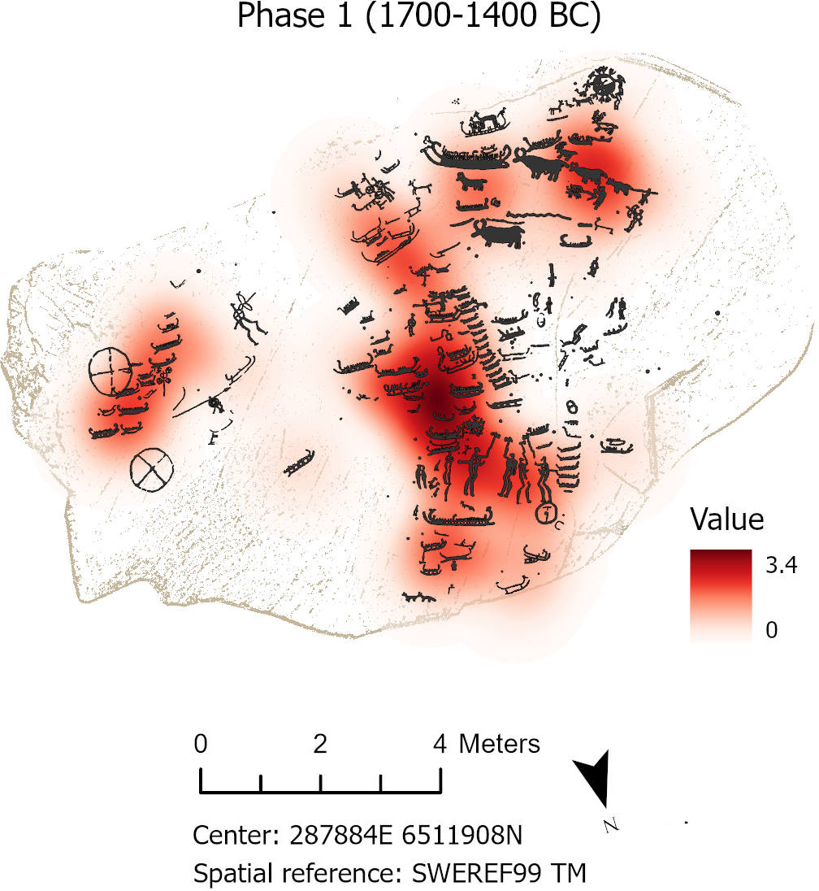

::: callout-note
This notebook was executed with R v`r getRversion()`
:::

## Introduction

This document provides the supplemental Information accompanying Chapter 4 of the book "[Masters of Water and Stone. Exploring the Role of Rock Art Carvers in Nordic Bronze Age Societies](https://www.oxbowbooks.com/9798888573044/masters-of-water-and-stone/)". All data required to reproduce the main analyses is in the Zenodo repository that includes this markdown document.

::: callout-important
Python code shown here is not executable. It is reproduced for the sole purpose of showing the parameters used in Arcgis Pro for analysis.

3D models can be examined and requested at <https://shfa.dh.gu.se>
:::

For more information about the research questions and rationale behind these analyses, as well as the interpretation of the results, please read the book.

## Directory and libraries

The following code loads and install, if necessary, all packages used in the script on the date they were last used to ensure reproducibility.

- `here` and `groundhog` are used for reproducibility

::: callout-tip
The function `groundhog.library` must be executed twice: one time to install packages, and another time to load them. To load the packages in the the current date run `lapply(pkgs, library, character.only=TRUE)` instead.
:::

- `readr` and `sf` are used to read .csv and .shp files

- `dplyr`, `forcats`, `purrr`, `tidyr` are used for data cleaning and exploratory data analysis

- `ggplot2` , `scales`, and `ggpubr` are used for plotting

- `knitr` and `rmarkdown` are used to produce the notebook

- `baorista` and `coda` are used for bayesian aoristic analysis.

::: callout-warning
In order to execute bayesian aoristics you need a working [C++ compiler](https://cran.r-project.org/bin/windows/Rtools/) compatible with the R version used. For more further details please read the [nimble package documentation](https://r-nimble.org/manual/cha-installing-nimble.html).
:::

```{r}
#| label: packages
#| message: false
#| warning: false

# Clean environment
rm(list=ls())

# Required packages
pkgs <- c("baorista", "coda", "dplyr", "forcats", "ggplot2", "ggpubr", "here", "magrittr", "knitr", "purrr", "readr", "renv", "scales", "sf", "tidyr", "rmarkdown")

# Load packages on date of use (and install if necessary)
require("groundhog")
groundhog.library(pkgs, "2024-06-13")

# Setting directory
here::i_am("scripts/Nothing-is-carved-on-stone.qmd")

```

## Import datasets

The data used in this script comes from a shape file and a csv file stored in /data. `AspebergetMotifs.shp` is a multipolygon feature containing every figure at Aspeberget annotated with information on type, size, depth, chronology, etc. `SuperimpositionsAspe.csv` indicates the stratigraphic relationship between superimposed figures.

```{r}
#| label: import
#| message: false
#| warning: false

# Import datasets
AspebergetFigures <- st_read(here("data/shp/AspebergetFigures.shp")) %>%
    st_drop_geometry()

Superimpositions <- read_csv(here("data/csv/SuperimpositionsAspe.csv"))

```

## Kernel density

To analyze the diachronic spatial use of the panels, figures with estimated dates where examined using the [Kernel Density](https://pro.arcgis.com/en/pro-app/latest/tool-reference/spatial-analyst/kernel-density.htm) tool for point features in ArcGIS Pro (v. 3.4.2). According to Esri documentation (2025):

> *Kernel Density calculates the density of point features around each output raster cell. A smoothly curved surface is fitted over each point. The surface value is highest at the location of the point and diminishes with increasing distance from the point, reaching zero at the Search radius distance from the point. The volume under the surface equals the Population field value for the point. The density at each output raster cell is calculated by adding the values of all the kernel surfaces where they overlay the raster cell center*.

To reproduce the results in ArcGIS Pro, import `AspebergetFigures.shp` and follow these steps:

1.  Transform polygons to points features.

``` python
 arcpy.management.FeatureToPoint(         in_features="AspebergetMotifs",         out_feature_class=r"C:/Users/Julian Moyano/Inst. för historiska studier Dropbox/Julian Moyano Di Carlo/DIGARV/Aspeberget/Aspeberget.gdb/AspebergetPoints",         point_location="CENTROID"     )
```

2.  Select figures from one of the panels analyzed and a given phase. Here it is only shown code for Tanum 12:1 and Phase 1.

``` python
 arcpy.management.SelectLayerByAttribute(         in_layer_or_view="AspebergetMotifs",         selection_type="NEW_SELECTION",         where_clause="RAAnr = 'Tanum 12:1' And Phase = '1'",         invert_where_clause=None     )
```

3.  Run Kernel Density analysis.

``` python
 with arcpy.EnvManager(scratchWorkspace=r"C:/Users/Julian Moyano/Inst. för historiska studier Dropbox/Julian Moyano Di Carlo/DIGARV/Aspeberget/Aspeberget.gdb"):         out_raster = arcpy.sa.KernelDensity(             in_features="AspebergetPoints",             population_field="NONE",             cell_size=0.868832800000906,             search_radius=None,             area_unit_scale_factor="SQUARE_METERS",             out_cell_values="DENSITIES",             method="PLANAR",             in_barriers=None         )         out_raster.save(r"C:/Users/Julian Moyano/Inst. för historiska studier Dropbox/Julian Moyano Di Carlo/DIGARV/Aspeberget/Aspeberget.gdb/KernelD_Tanum12_Ph1")
```

{fig-align="center" width="50%"}

## Exploration of superimpositions

These plots explore superimposition relationships. A superimposition is “an instance of one rock art motif having been placed over another, earlier motif” (Bednarik, 2000, p. 154). To determine which figure lies on top, I analyzed the pecking pattern at the point where the grooves intersect (Zotkina, 2019). If the pecking pattern at the intersection was inconclusive, I established the stratigraphic relationship based on the chronology of the figures, as indicated by their typology. If no chronological markers existed, I followed the common convention that deeper figures were carved later. Although the inverse is theoretically possible, all field testing confirmed that the assumption is valid except for a few cases where the earlier figure was re-carved in a later period.

Note that superimpositions between phases might have been partially influenced by the lower rock art production during the LBA, and that EBA figures had a higher probability of being superimposed simply because they were exposed for a longer period. Likewise, ships and humans may have been involved more frequently in superimpositions because they are more numerous than other figures

```{r}
#| label: superimpositions
#| message: false
#| warning: false
#| fig-width: 15
#| fig-height: 8

# Heatmap of superimpositions by type
hmp_sup_type <- Superimpositions %>%
    filter(OverType != "Indeterminate", UnderType != "Indeterminate") %>% 
    count(OverType, UnderType) %>% 
    ggplot(aes(x = UnderType, y = OverType, fill = n)) +
        geom_tile(color = "white", lwd = 1.5, linetype = 1) +
        scale_fill_gradient(low = "lightpink", high = "red") +
        scale_x_discrete(guide = guide_axis(angle = 45)) +
        geom_text(aes(label = n), color = "black", size = 4) +
        theme_linedraw() +
        theme(legend.position = "none",
              plot.title = element_text(size = 14, hjust = 0.5)) +
        labs(x = "Under",
             y = "Over") 

# Heatmap of superimpositions by phase
hmp_sup_phase <- Superimpositions %>%
    filter(OverPhase != "Indeterminate", UnderPhase != "Indeterminate") %>% 
    count(OverPhase, UnderPhase) %>% 
    ggplot(aes(x = UnderPhase, y = OverPhase, fill = n)) +
        geom_tile(color = "white", lwd = 1.5, linetype = 1) +
        scale_fill_gradient(low = "lightpink", high = "red") +
        scale_x_discrete(labels=c("1" = "Phase 1",
                                  "2" = "Phase 2",
                                  "3" = "Phase 3",
                                  "4" = "Phase 4"),
                         guide = guide_axis(angle = 45)) +
        scale_y_discrete(labels=c("1" = "Phase 1",
                                  "2" = "Phase 2",
                                  "3" = "Phase 3",
                                  "4" = "Phase 4",
                                  "5" = "Phase 5")) +
        geom_text(aes(label = n), color = "black", size = 4) +
        theme_linedraw() +
        theme(legend.position = "none",
              plot.title = element_text(size = 14, hjust = 0.5)) +
        labs(x = "Under",
             y = "Over")

# Plot grid
ggarrange(hmp_sup_type, hmp_sup_phase, nrow = 1, align = "h", labels = "AUTO")
```

## Exploration of depth and size of figures

Calculating the depth of the figures is computationally challenging due to variations in slope and the complex morphology of some figures. Manual measurements, on the other hand, are time-consuming and difficult to scale. To address this issue, depth is assessed relatively by calculating the *volume* of each figure.

Volume was calculated in Agisoft Metashape (v2.0+) by importing `AspebergetFigures.shp` and using the [Measure tool](https://agisoft.freshdesk.com/support/solutions/articles/31000170365-measurement-tools-in-model-view) on the 3D model of each panel. Because shallow but large figures can yield large volumes, depth is expressed as the volume-to-area ratio (in m^3^). Given the irregularity of the carvings' shapes, this ratio provides only an *average* depth.

Size was determined as the area of each figure (in m^2^) using the [Add Surface Information](https://pro.arcgis.com/en/pro-app/latest/tool-reference/spatial-analyst/add-surface-information.htm) tool in ArcGIS Pro (v3.4.2).

The analysis includes only those figures that can be certainly assigned to one of the five main chronological phases considered in this study. Furthermore, only the earliest date associated with each figure is used to avoid overrepresentation of figures that were later modified or updated.

```{r}
#| label: depth-size
#| message: false
#| warning: false
#| fig-width: 12
#| fig-height: 6

# Exploratio of depth
bxp_depth <- AspebergetFigures %>% 
    filter(Volume > 0, Phase %in% 1:5, Update == "No") %>% 
    # turn volume units to volume-area ratio in mm
    mutate(Depth = (Volume/Area) * 1000,
           Phase = factor(Phase, levels = 1:5, labels = paste("Phase", 1:5))) %>% 
    group_by(Phase) %>% 
    mutate(total = n(), PhaseN =  paste0(Phase, "\n(n=", total, ")")) %>% 
    ungroup() %>% 
    ggplot(aes(x = PhaseN, y = Depth)) + 
        geom_boxplot(outlier.alpha = 0.75,
                     fill = "darkgrey") +
        stat_kruskal_test(label.y = 5, label.x = 4) +
        scale_y_continuous(breaks = seq(0, 5, 1)) +
        theme_linedraw() +
        theme(panel.grid = element_blank()) +
        labs(x = NULL,
             y = "Average depth (mm)")

# Exploration of size
bxp_size <- AspebergetFigures %>% 
    filter(Volume > 0, Phase %in% 1:5, Update == "No") %>% 
    # turn area units to cm2
    mutate(Size = Area * 10000,
           Phase = factor(Phase, levels = 1:5, labels = paste("Phase", 1:5))) %>% 
    group_by(Phase) %>% 
    mutate(total = n(), PhaseN =  paste0(Phase, "\n(n=", total, ")")) %>% 
    ungroup() %>% 
    ggplot(aes(x = PhaseN, y = Size)) + 
        geom_boxplot(outlier.alpha = 0.75,
                     fill = "darkgrey") +
        stat_kruskal_test(label.y = 2500, label.x = 4) +
        scale_y_continuous(breaks = seq(0, 2500, 500)) +
        theme_linedraw() +
        theme(panel.grid = element_blank()) +
        labs(x = NULL, y = expression(paste("Area  ", "(", cm^{2}, ")")))


# Depth vs size
scp_depth_size <- AspebergetFigures %>% 
    filter(Volume > 0,
           Phase %in% 1:5,
           Update == "No") %>% 
    # Turn volume to depth (mm) and area to cm2
    mutate(Depth = (Volume/Area) * 1000,
           Size = Area * 10000) %>% 
    ggplot(aes(x = Depth, y = Size, color = Phase)) +
        geom_point(alpha = 0.6,
                   size = 2.5) +
        geom_smooth(method = "lm",
                    se = F,
                    show.legend = FALSE) +
        scale_x_log10(labels = label_number()) +
        scale_y_log10(labels = label_number()) +
        scale_color_discrete(name = NULL, labels = c("Phase 1", "Phase 2", "Phase 3", "Phase 4", "Phase 5")) +
        stat_cor(p.accuracy = 0.001, r.accuracy = 0.01, show.legend = FALSE) +
        theme_linedraw() +
        theme(panel.grid = element_blank(),
              legend.position = "inside",
              legend.position.inside = c(0.9, 0.25)) +
        labs(y = expression(paste("Area ", "(", cm^{2}, ")")),
             x = "Average depth (mm)")

# Plot grid
ggarrange(ggarrange(bxp_depth, bxp_size,
                    ncol = 1,
                    labels = c("A", "B")),
          ggarrange(scp_depth_size,
                    labels = "C"), align = "h")
```

## Time intervals

To visualize the temporal use of different panels at Aspeberget, the following plot shows the time interval(s) during which a given panel shows carving activity, and the phase in which that activity was highest (marked at the midpoint of that phase).

```{r}
#| label: intervals
#| message: false
#| warning: false
#| fig-width: 9
#| fig-height: 6

# Arrange panels by most numerous phase
factor_levels <- c("Tanum 17:1", "Tanum 16:2", "Tanum 22:1", "Tanum 119:1", "Tanum 28:1", "Tanum 13:1", "Tanum 15:1", "Tanum 23:1", "Tanum 25:1", "Tanum 12:1", "Tanum 18:1", "Tanum 120:1", "Tanum 19:1", "Tanum 29:1", "Tanum 14:1", "Tanum 26:1", "Tanum 16:1")

# Labels to mark phases
phases_labels <- data.frame(midpoint = c(1725, 1425, 1125, 925, 625),
                            y = c(16.4),
                            label = c("Phase 1", "Phase 2", "Phase 3", "Phase 4", "Phase 5"))

# Plot
AspebergetFigures %>% 
    filter(Phase %in% 1:5) %>% 
    count(RAAnr, Phase, LowerDate, UpperDate) %>%
    group_by(RAAnr) %>%
    mutate(TopYear = (LowerDate[n == max(n)][1] + UpperDate[n == max(n)][1]) / 2)  %>% 
    ungroup() %>%
    mutate(RAAnr = fct_relevel(RAAnr, factor_levels)) %>% 
    ggplot(aes(x = LowerDate, y = RAAnr)) +
    geom_segment(aes(x = LowerDate, xend = UpperDate,
                     y = RAAnr, yend = RAAnr)) +
    geom_point(aes(x = TopYear, y = RAAnr)) +
    geom_vline(xintercept = c(1700, 1400, 1100, 900, 600),
               linetype = 2,
               color = "gray20",
               alpha = 0.75) +
    geom_text(data = phases_labels,
              aes(x = midpoint, y = y, label = label),
              inherit.aes = FALSE,
              angle = 90,
              size = 3.5) +
    scale_x_reverse(breaks = seq(300, 1700, 200)) +
    theme_linedraw() +
    theme(panel.grid.minor = element_blank(),
          panel.grid.major.y = element_blank()) +
    labs(x = "Years (BC)", y = NULL)
```

## Aoristic analysis

Aoristic analysis is a method developed in crime science to estimate when a given event occurred. Instead of a precise timestamp, the available information is a time span bounded by an initial and an end time. As described by the method's developers (Ratcliffe and McCullagh 1998):

> *Rather than making an arbitrary choice of one particular time point along the time span, aoristic analysis evenly distributes the probability of a crime event across each hour of the time span*

This method visualizes the temporal distribution of figures across panels at Aspeberget. Each panel contains multiple figures from different chronological phases (e.g., Phase 1, Phase 2, Phase 3), each representing a specific time span (e.g., 1700–1400 BC, 1400–1100 BC, 1100–900 BC). While the number of figures per phase could be visualized with a simple bar plot, this approach has a significant limitation: some figures cannot be confidently assigned to a single phase. This is especially true for figures that may belong to multiple phases or for which only a *terminus post quem* or *terminus ante quem* is known. For example, a figure superimposed on a Phase 2 figure has a *terminus post quem* of 1400 BC—the earliest possible date for that phase. Assuming the figure belongs to the Bronze Age or Early Pre-Roman Iron Age, its time span would extend from 1400 to 300 BC. Such chronological uncertainty cannot be effectively represented in a bar plot. Instead, aoristic analysis is used to incorporate these figures into the temporal analysis. This method accounts for the probability that a figure belongs to a given year within its possible time span, allowing for a more nuanced and inclusive representation of the temporal distribution.

Here, I use the Bayesian solution proposed by Crema (2024) to address many of the issues with traditional aoristic analysis when dealing with archaeological periodizations. The model was applied to panels with at least two phases represented and at least five dated figures.

::: callout-warning
For the sake of computational efficiency, the code presented does not reach convergence: `icarfit(probMat, niter = 500000, nburnin = 50000, thin = 50, nchains = 4, parallel = TRUE)`. To reach convergence consider increasing the number of iterations.
:::

::: callout-tip
Since fitting the ICAR model can take some time, the process can be skipped by loading a .rds file with `aoristic_model <- readRDS(here("output/aoristic_model.rds"))`
:::

```{r}
#| label: aoristic
#| message: false
#| warning: false
#| fig-width: 7
#| fig-height: 10

# Prepare data
AspebergetBP <- AspebergetFigures %>%
    st_drop_geometry() %>% 
    mutate(Start = case_when(Phase == 1 ~ 1700,
                             Phase == 2 ~ 1400,
                             Phase == 3 ~ 1100, 
                             Phase == 4 ~ 900,
                             Phase == 5 ~ 600,
                             Phase == "<=2" ~ 1700,
                             Phase == ">=2" ~ 1400,
                             Phase == ">=3" ~ 1100,
                             Phase == "0-2" ~ 2000,
                             Phase == "1-2" ~ 1700,
                             Phase == "1-4" ~ 1700,
                             Phase == "3-4" ~ 1100,
                             Phase == "4-5" ~ 900,
                             Phase == "Indeterminate" ~ 1700),
           End = case_when(Phase == 1 ~ 1400,
                           Phase == 2 ~ 1100,  
                           Phase == 3 ~ 900, 
                           Phase == 4 ~ 600,
                           Phase == 5 ~ 300,
                           Phase == "<=2" ~ 1100,
                           Phase == ">=2" ~ 300,
                           Phase == ">=3" ~ 300,
                           Phase == "0-2" ~ 1100,
                           Phase == "1-2" ~ 1100,
                           Phase == "1-4" ~ 600,
                           Phase == "3-4" ~ 600,
                           Phase == "4-5" ~ 300,
                           Phase == "Indeterminate" ~ 300)) %>% 
    filter(!is.na(Start), Phase != "Indeterminate") %>% 
    mutate_at(vars(Start, End), as.numeric) %>% 
    # Filter panels with less than 5 dated figures
    group_by(RAAnr) %>% 
    filter(n() > 4) %>% 
    ungroup() %>% 
    # BC to BP
    mutate(Start = Start + 1950, End = End + 1950)

# Pick panels names
panel_list <- AspebergetBP %>% distinct(RAAnr) %>% pull()

# Aoristic fitting 
panel_results <- map(panel_list, function(panel_name) {
    ## 1. Filter panel
    probMat <- createProbMat(
        x = AspebergetBP %>% 
            filter(RAAnr == panel_name) %>% 
            select(Start, End),
        timeRange = c(3950, 2151),
        resolution = 50
    )
    
    ## 2. Fit ICAR
    fit <- icarfit(probMat,
                   niter = 500000,
                   nburnin = 50000,
                   thin = 50,
                   nchains = 4,
                   parallel = TRUE)
    
    ## 3. Extract posterior summaries
    tibble(fit$x$tblocks) %>%
        mutate(midpoint = round((starts + ends) / 2) - 1950,
               pmean = apply(fit$posterior.p, 2, mean),
               lower50 = HPDinterval(as.mcmc(fit$posterior.p), prob = .50)[,1],
               upper50 = HPDinterval(as.mcmc(fit$posterior.p), prob = .50)[,2],
               lower90 = HPDinterval(as.mcmc(fit$posterior.p), prob = .90)[,1],
               upper90 = HPDinterval(as.mcmc(fit$posterior.p), prob = .90)[,2],
               panel = panel_name)
})

# Combine results
aoristic_model <- bind_rows(panel_results) %>% 
  mutate(panel = factor(panel, levels = c("Tanum 12:1", "Tanum 15:1", "Tanum 18:1", "Tanum 22:1", "Tanum 25:1", "Tanum 28:1", "Tanum 119:1", "Tanum 120:1")))

# Save RDS
saveRDS(aoristic_model, here("output/aoristic_model.rds"))

# Phase labels for plot
phases_labels <- tibble(x = c(1725, 1425, 1125, 925, 625),
                        y = rep(0.18,5),
                        label = c("Phase 1", "Phase 2", "Phase 3", "Phase 4", "Phase 5"),
                        panel = factor("Tanum 28:1"))

# Plot
aoristic_model %>% 
    mutate(panel = factor(panel, levels = c("Tanum 28:1", "Tanum 22:1", "Tanum 12:1", "Tanum 25:1",
                                            "Tanum 18:1", "Tanum 15:1", "Tanum 119:1", "Tanum 120:1"))) %>% 
    ggplot(aes(x = midpoint, y = pmean)) +
    geom_segment(aes(x = midpoint, y = lower90, xend = midpoint, yend = upper90),
                 linewidth = 7, color = "#add8e6") +
    geom_segment(aes(x = midpoint, y = lower50, xend = midpoint, yend = upper50),
                 linewidth = 7, color = "#4682B4") +
    geom_vline(xintercept = c(1700, 1400, 1100, 900, 600),
               linetype = 2,
               color = "gray20",
               alpha = 0.75) +
    geom_text(data = phases_labels, aes(x = x, y = y, label = label),
              inherit.aes = FALSE,
              angle = 90,
              size = 3) +
    geom_point() +
    scale_x_reverse(breaks = seq(300, 2000, 200)) +
    facet_wrap(vars(panel), ncol = 1, scales = "free_y", 
               strip.position = "right") +
    theme_light() +
    theme(panel.grid = element_blank(),
          panel.spacing = unit(0.1, "lines"),
          axis.ticks = element_line(color = "black"),
          axis.text.x = element_text(color = "black"), 
          axis.text.y = element_text(color = "black"),
          panel.border = element_rect(color = "black"),
          strip.background = element_rect(color = "black"),
          strip.text = element_text(color = "gray5")) +
    labs(x = "Years cal. BC",
         y = "Probability Mass")
```

## References

Bednarik, Robert G. 2000. “Rock Art Glossary.” Rock Art Research (Melbourne) 17 (2): 147–55.

Crema, E. R. 2024. “A Bayesian Alternative for Aoristic Analyses in Archaeology.” Archaeometry 67 (S1): 7–30. <https://doi.org/10.1111/arcm.12984>.

Ratcliffe, J. H., and McCullagh, M. J. 1998. “Aoristic Crime Analysis.” International Journal of Geographical Information Science 12 (7): 751–64. <https://doi.org/10.1080/136588198241644>.

Zotkina, Lydia V. 2019. “On the Methodology of Studying Palimpsests in Rock Art: The Case of the Shalabolino Rock Art Site, Krasnoyarsk Territory.” Archaeology, Ethnology & Anthropology of Eurasia 47 (2): 93–102.
