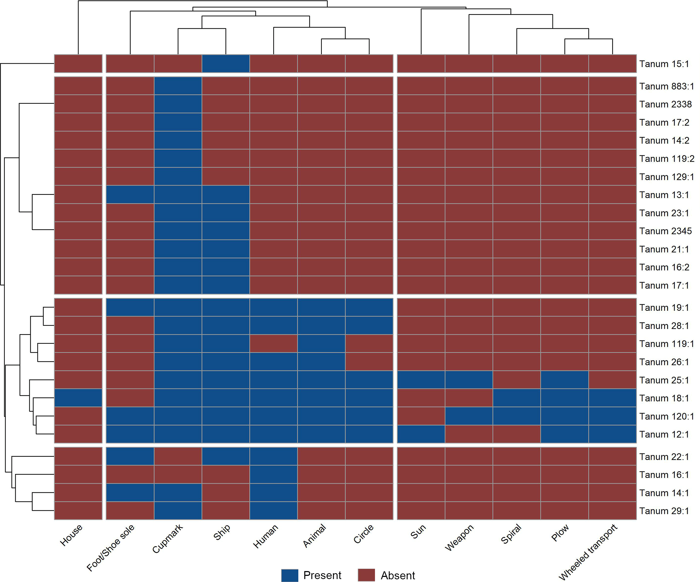

::: callout-note
This notebook was executed with R v`r getRversion()`
:::

## Introduction

This document provides the supplemental Information accompanying Chapter 6 of the book "[Masters of Water and Stone. Exploring the Role of Rock Art Carvers in Nordic Bronze Age Societies](https://www.oxbowbooks.com/9798888573044/masters-of-water-and-stone/)". All data required to reproduce the main analyses is available in the Zenodo repository that includes this markdown document.

::: callout-important
Python code shown here is not executable. It is reproduced for the sole purpose of showing the parameters used in Arcgis Pro for analysis.

The maps of this study were created using elevation data from Lantmäteriet which is not open source. To obtain elevation data use SLU [search service](https://service.seamlessaccess.org/ds/?entityID=https%3A%2F%2Fmaps.slu.se%2Fshibboleth&return=https%3A%2F%2Fmaps.slu.se%2FShibboleth.sso%2FLogin%3FSAMLDS%3D1%26target%3Dss%253Amem%253Aa53c519fbacb5a0e27d7b896c970c2caca81513b4aa7e7e141b256581976b1f8).
:::

For more information about the research questions and rationale behind these analyses, as well as the interpretation of the results, please read the book.

## Directory and libraries

The following code loads and install, if necessary, all packages used in the script on the date they were last used to ensure reproducibility.

- `here` and `groundhog` are used for reproducibility

::: callout-tip
The function `groundhog.library` must be executed twice: one time to install packages, and another time to load them. To load the packages in the the current date run `lapply(pkgs, library, character.only=TRUE)` instead.
:::

- `readr` and `sf` are used to read .csv and .shp files

- `dplyr`, `forcats`, `magrittr`, `reshape2`, `tibble` and `tdyr` are use for data cleaning and exploratory data analysis

- `ggplot2`, `ggpubr`, `ggrepel`, `ggtext`, `grid`, `gridExtra`, and `scales` are used for plotting

- `spatstat` is used for spatial analysis

- `vegan` is used to calculate ecological metrics

- `cluster`, `factorextra`, and `pheatmap` are used for cluster analysis

- `knitr` and `rmarkdown` are used to produce the notebook

```{r}
#| label: packages
#| message: false
#| warning: false

# Clean environment
rm(list=ls())

# Required packages
pkgs <- c("cluster", "dplyr", "factoextra", "forcats", "ggplot2", "ggpubr", "ggrepel", "ggtext", "grid", "gridExtra", "here", "knitr", "magrittr", "pheatmap", "readr", "reshape2", "rmarkdown", "scales", "sf", "spatstat", "tibble", "tidyr", "vegan")

# Load packages on date of use (and install if necessary)
require("groundhog")
groundhog.library(pkgs, "2025-10-1")

# Setting directory
here::i_am("scripts/The-big-got-bigger.qmd")
```

## Datasets

The data used in this script comes from two shapefiles. `BohuslanPanels.shp` contains a point feature with counts of figures for every panel with at least two figures in western Bohuslän, registered in Förnsok by October 2023. `AspebergetFigures.shp` is a multipolygon feature with every figure at Aspeberget, including additional information (type, size, depth, chronology, etc.).

```{r}
#| label: import
#| message: false
#| warning: false

# Load Western Bohuslän panels 
bohuslan_panels_wide <- st_read(here("data/shp/BohuslanPanels.shp")) %>% 
    # remove geometry for manipulation
    st_drop_geometry()
    
# Transform BohuslanPanels in tidy format 
bohuslan_panels_long <- bohuslan_panels_wide %>%
    # remove variables used in GIS
    select(1:26) %>% 
    pivot_longer(cols = 6:26, names_to = "Type", values_to = "Count") %>%
    mutate(Count = as.integer(Count)) %>% 
    uncount(Count) 

# Load Aspeberget figures 
aspe_figures_long <- st_read(here("data/shp/AspebergetFigures.shp")) %>% 
    # remove geometry for manipulation
    st_drop_geometry()  %>% 
    # remove "panels" with only one figure
    group_by(Lamningsnr) %>% 
    filter(n() > 1) %>% 
    ungroup()

# Aspeberget panels RAÅ numbers and Lämningsnummers for filtering
aspeberget_panels <- c("Tanum 12:1","Tanum 13:1","Tanum 14:1","Tanum 14:2","Tanum 15:1","Tanum 16:1","Tanum 16:2","Tanum 17:1","Tanum 17:2","Tanum 18:1","Tanum 19:1","Tanum 21:1","Tanum 22:1","Tanum 23:1","Tanum 24:1","Tanum 25:1","Tanum 26:1","Tanum 28:1","Tanum 29:1","Tanum 84:1","Tanum 119:1","Tanum 119:2","Tanum 120:1","Tanum 129:1","Tanum 883:1","Tanum 2338","Tanum 2345", "L1968:7148", "L1968:7560", "L1968:7670", "L1968:7449", "L1968:7552", "L1968:7101", "L1968:7660", "L1968:7160", "L1968:7850", "L1967:2415", "L1968:7302", "L1968:7401", "L1968:7497", "L1968:7505", "L1968:7603", "L1968:7610", "L1968:7752", "L1968:7805", "L1968:7305", "L1968:7666", "L1968:7663", "L1968:7443", "L1968:7758", "L1968:7456", "L1967:3416", "L1959:2584", "L1959:2719")
```

## Frequency distribution of figures

Visual exploration of the frequency distribution of figures per panel in Aspeberget and western Bohuslän. Given the high skewness of the data, some axes are plotted on a logarithmic scale.

```{r}
#| label: frequency-figures
#| message: false
#| warning: false
#| fig-width: 12
#| fig-height: 6

# Histogram figure frequency in Aspeberget
hist_aspe <- bohuslan_panels_long %>% 
    filter(Lamningsnr %in% aspeberget_panels) %>% 
    count(Lamningsnr) %>%
    ggplot(aes(x = n)) +
        geom_histogram(fill = "darkgrey",
                       color = "grey20",
                       bins = 8) +
        labs(title = "Aspeberget",
             x = "Number of figures",
             y = "Number of panels") +
        theme_linedraw() +
        theme(plot.title = element_text(size = 14,
                                        hjust = 0.55),
              panel.grid = element_blank()) 

# Histogram figure frequency in Bohuslän
hist_bohus <- bohuslan_panels_long %>% 
    count(Lamningsnr) %>%
    ggplot(aes(x = n)) +
        geom_histogram(fill = "darkgrey",
                       color = "grey20") +
        annotate(geom = "text", x = 900, y = 500, label = "Tanum 66:1 (n = 1017)") +
        annotate(geom = "segment", x = 1017, yend = 400, y = 10, xend = 900) +
        labs(title = "Western Bohuslän",
             x = "Number of figures",
             y = "Number of panels") +
        theme_linedraw() +
        theme(plot.title = element_text(size = 14,
                                        hjust = 0.55),
              panel.grid = element_blank()) 
                        
# Grid of plots
ggarrange(hist_aspe, hist_bohus, nrow = 1, align = "h", labels = "AUTO")
```

### Frequency distribution by phase

The analysis presented above does not account for the chronology of the figures, which may skew the results. Unfortunately, not all figures documented in Bohuslän can be dated. Below is the frequency distribution, grouped by phases, for the figures that can be dated at Aspeberget.

```{r}
#| label: dist-phases
#| message: false
#| warning: false

# Labels for phases
pretty_labels <- c(`1` = "Phase 1",
                   `2` = "Phase 2",
                   `3` = "Phase 3",
                   `4` = "Phase 4",
                   `5` = "Phase 5")
# Plot                   
aspe_figures_long %>%
    filter(Phase %in% 1:5) %>%
    count(RAAnr, Phase) %>% 
    ggplot(aes(x = n)) +
        geom_histogram(fill = "darkgrey",
                       color = "grey20") +
        facet_wrap(vars(Phase), scales = "free_x",
                   labeller = labeller(Phase = pretty_labels)) +
        labs(x = "Number of figures", y = "Number of panels") +
        theme_light() +
        theme(panel.grid = element_blank(),
              strip.text = element_text(color = "black")) 
```

## Distribution of figures types

Visual exploration of the frequency distribution of figures per type in Aspeberget and western Bohuslän. Aspeberget counts are shown between parentheses. Given the high skewness of the data, some axes are plotted on a logarithmic scale.

```{r}
#| label: frequency-types
#| message: false
#| warning: false
#| fig-width: 16
#| fig-height: 8

# Western Bohuslän counts
bohus_counts <- bohuslan_panels_long %>%
  count(Type, name = "bohus_n") 

# Aspeberget counts
aspe_counts <- bohuslan_panels_long %>%
  filter(Lamningsnr %in% aspeberget_panels) %>%
  count(Type, name = "aspe_n")

# Combine
bp_data <- bohus_counts %>%
  left_join(aspe_counts, by = "Type") %>%
  mutate(aspe_n = replace_na(aspe_n, 0))

# Bar plot Western Bohuslän
bp_bohus <- bp_data %>%  
   # plot
    ggplot(aes(x = fct_reorder(Type, bohus_n), y = bohus_n)) +
        geom_col(color = "grey20",
                 fill = "darkgrey") +
        geom_text(aes(label = paste0(bohus_n, " (", aspe_n, ")"), group = 1),
                  hjust = -0.15) +
        coord_flip() +
        scale_x_discrete(labels = c("Indetermin" = "Indeterminate",
                                    "Foot_Shoe" = "Foot or shoe",
                                    "Wheeled_tr" = "Wheeled transport",
                                    "Paw_print" = "Paw print",
                                    "Sun_Holder" = "Sun holder")) +
        scale_y_continuous(breaks = seq(0, 60000, 10000),
                           limits = c(0, 60000)) +
        labs(x = NULL,
             y = "Number of figures") +
        theme_linedraw() +
        theme(plot.title = element_text(size = 14,
                                        hjust = 0.5),
              panel.grid = element_blank()) 

```

## Panels by deciles

Distribution of figures and types across panels by deciles. The goal is to examine how figures were distributed across panels over time.

```{r}
#| label: deciles
#| message: false
#| warning: false

# Count of figures per type in Bohuslan
bohus_type_freq <- bohuslan_panels_long %>%  
    ungroup() %>%
    count(Type, sort = TRUE, name = "Western Bohuslän")

# Count of figures in Aspeberget
aspe_type_freq <- bohuslan_panels_long %>%
    filter(RAAnr %in% aspeberget_panels) %>% 
    count(Type, sort = TRUE, name = "Aspeberget")

# Joining
bohus_type_freq %<>%
    left_join(aspe_type_freq) %>% 
    mutate(prop = Aspeberget / `Western Bohuslän`)

# Proportion of figures in Bohuslän depicted in aspeberget 
prop_figures_aspe <-  bohus_type_freq %>%
    summarise(prop_WestBohuslan = sum(Aspeberget, na.rm = TRUE) / sum(`Western Bohuslän`)) %>%
    pull()

# Proportion of figures types in Bohuslän depicted in Aspeberget
prop_types_aspe <- (bohus_type_freq %>% drop_na() %>% nrow()) / nrow(bohus_type_freq) 

# Deciles in Aspeberget
deciles_aspe <- aspe_figures_long %>% 
    count(RAAnr) %>% 
    mutate(percentile = percent_rank(n)) %>%
    mutate(decile = case_when(between(percentile, 0, 0.1) ~ 1,
                              between(percentile, 0.1, 0.2) ~ 2,
                              between(percentile, 0.2, 0.3) ~ 3,
                              between(percentile, 0.3, 0.4) ~ 4,
                              between(percentile, 0.4, 0.5) ~ 5,
                              between(percentile, 0.5, 0.6) ~ 6,
                              between(percentile, 0.6, 0.7) ~ 7,
                              between(percentile, 0.7, 0.8) ~ 8,
                              between(percentile, 0.8, 0.9) ~ 9,
                              between(percentile, 0.9, 1) ~ 10),
           prop_figures = n / sum(n)) %>% 
    arrange(n)

# Figures types by decile in Aspeberget
types_by_decile_aspeberget = aspe_figures_long %>%
    left_join(select(deciles_aspe, RAAnr, decile),
              by = join_by("RAAnr")) %>%
    group_by(decile) %>%
    summarise(n_types = n_distinct(Type))

# Deciles in western Bohuslän
deciles_bohuslan <- bohuslan_panels_long %>%
    count(Lamningsnr) %>% 
    mutate(percentile = percent_rank(n)) %>%
    mutate(decile = case_when(between(percentile, 0, 0.1) ~ 1,
                              between(percentile, 0.1, 0.2) ~ 2,
                              between(percentile, 0.2, 0.3) ~ 3,
                              between(percentile, 0.3, 0.4) ~ 4,
                              between(percentile, 0.4, 0.5) ~ 5,
                              between(percentile, 0.5, 0.6) ~ 6,
                              between(percentile, 0.6, 0.7) ~ 7,
                              between(percentile, 0.7, 0.8) ~ 8,
                              between(percentile, 0.8, 0.9) ~ 9,
                              between(percentile, 0.9, 1) ~ 10),
           prop_panel = n / sum(n)) %>% 
    arrange(n)

# Figures by decile in Bohuslän
figures_by_decile_bohuslan <- deciles_bohuslan %>% 
    group_by(decile) %>% 
    summarise(prop_decile = sum(prop_panel))

# Figures types by decile in Bohuslän
types_by_decile_bohuslan <- bohuslan_panels_long %>% 
    ungroup() %>%
    left_join(select(deciles_bohuslan, Lamningsnr, decile),
              by = join_by("Lamningsnr")) %>%
    group_by(decile) %>%
    summarise(n_types = n_distinct(Type))
```

## Diversity of panels

Panel diversity is defined as the number of figures and the number of figure types present. After testing different metrics (e.g., the Inverse Simpson index), Shannon entropy was chosen as the diversity metric (Oksanen et al. 2024). The Shannon diversity index is a widely used metric in ecology. It is based on Claude Shannon’s formula for entropy and estimates species diversity. The index considers the number of species in a habitat (richness) and their relative abundance (evenness). $$H = -\sum_{i=1}^{r} p_i \ln (p_i)$$ Because it uses frequencies, this method can be applied to any categorical count data. However, some argue that the Shannon index is not a measure of true diversity (H’). While two observations with the same Shannon entropy are equally diverse, an observation with twice the Shannon entropy does not represent twice the diversity. To account for this, the exponential of Shannon entropy was calculated (Jost 2006). The analysis is performed only on figurative panels.

```{r}
#| label: diversity
#| message: false
#| warning: false
#| fig-width: 14
#| fig-height: 6

# Shannon diversity for panels at Aspeberget
H_aspeberget <- bohuslan_panels_wide %>% 
    filter(RAAnr %in% aspeberget_panels) %>% 
    # create matrix
    column_to_rownames("RAAnr") %>% 
    select(Animal:Wheeled_tr) %>% 
    select(!Indetermin) %>% 
    diversity(index = "shannon")

# True diversity according to Jost
H_aspeberget <- exp(H_aspeberget)

# Shannon diversity for panels in Bohuslän
H_bohuslan <- bohuslan_panels_wide %>% 
    column_to_rownames("Lamningsnr") %>% 
    select(Animal:Wheeled_tr) %>% 
    select(!Indetermin) %>% 
    diversity(index = "shannon")

# True diversity according to Jost
H_bohuslan <- exp(H_bohuslan)

# Figurate vs non figurative panels in Bohuslän for filtering
figurative <- bohuslan_panels_wide %>%
    mutate(Figurative = case_when(Cupmark > 0 & rowSums(select(., Animal:Wheeled_tr, -Cupmark)) == 0 ~ "No",
                                    Indetermin > 0 & rowSums(select(., Animal:Wheeled_tr, -Indetermin)) == 0 ~ "No",
                                    Cupmark > 0 & Indetermin > 0 & rowSums(select(., Animal:Wheeled_tr, -Cupmark, -Indetermin)) == 0 ~ "No",
                                    .default = "Yes")) %>% 
    select(Lamningsnr, Figurative)

# Diversity vs frequency of figures Aspeberget
H_N_aspe <- aspe_figures_long %>%
    left_join(figurative) %>% 
    # select only figurative panels
    filter(Figurative == "Yes") %>% 
    group_by(RAAnr) %>% 
    summarise(Nfigures = n()) %>% 
    left_join(enframe(H_aspeberget,
                      name = "RAAnr", value = "Diversity")) %>%  
    ggplot(aes(x = Nfigures, y = Diversity, label = RAAnr)) +
        geom_smooth(method = "lm", linetype = 2, color = "grey15") +
        geom_point(size = 2) +
        scale_x_log10(labels = label_number()) +
        stat_cor(p.accuracy = 0.001, r.accuracy = 0.01,
                 label.x = 0.3, label.y = 4) +
        geom_text_repel() +
        labs(title = "Aspeberget",
                 x = "Number of figures",
                 y = "Diversity (H')") +
        theme_linedraw() +
        theme(plot.title = element_text(size = 14, hjust = 0.5),
              panel.grid = element_blank())

# Diversity vs frequency of figures Bohuslän
H_N_bohus <- bohuslan_panels_long %>%
    left_join(figurative) %>% 
    # select only figurative panels
    filter(Figurative == "Yes") %>% 
    group_by(Lamningsnr) %>% 
    summarise(Nfigures = n()) %>% 
    left_join(enframe(H_bohuslan,
                      name = "Lamningsnr", value = "Diversity")) %>%
    # remove panels with less than 5 figures to improve visualization
    filter(Nfigures > 5) %>%  
    # plot
    ggplot(aes(x = Nfigures, y = Diversity)) +
        geom_point(size = 2, alpha = 0.5) +
        scale_x_log10(labels = label_number()) +
        scale_y_continuous(breaks = seq(0, 7, 1)) +
        labs(title = "Western Bohuslän",
             x = "Number of figures",
             y = "Diversity (H')") +
        theme_linedraw() +
        theme(plot.title = element_text(size = 14, hjust = 0.5),
              panel.grid = element_blank())

# Combined plots
ggarrange(H_N_aspe, H_N_bohus, nrow = 1, align = "h", labels = "AUTO")
```

## Association between size, volume and diversity

Variation in size and volume across panels and their association with the diversity of such panels. The procedure to calculate these metrics was as follows:

1.  Area was calculated in ArcGIS Pro (v3.2.1) using the tool [Add Surface Information](https://pro.arcgis.com/en/pro-app/latest/tool-reference/spatial-analyst/add-surface-information.htm) and it is expressed in m^2^:

``` python
# Example of area calculation on Tanum 12:1. 
arcpy.ddd.AddSurfaceInformation(
    in_feature_class="Tanum12_Figures",
    in_surface="Tanum_12_DEM.tif",
    out_property="SURFACE_AREA",
    method="BILINEAR",
    sample_distance=0.01,
    z_factor=1,
    pyramid_level_resolution=0,
    noise_filtering=""
    )
```

2.  Volume was calculated in Agisoft Metashape (v2.0+). First, shape files of Aspeberget were imported into Metashape using the *Import Shapes* command from the context menu. Second, the ID of each figure was added to the shape using python code (see below). Third, volume was calculated using the *Measure* command from the context menu. Finally, the data was exported as excel file and joined by ID to the original dataset:

``` python
# Add ID labels to shapes
import Metashape
    ATTR = "DIGARVID"
    for shape in Metashape.app.document.chunk.shapes:
        if ATTR in shape.attributes.keys():
            shape.label = shape.attributes[ATTR]
```

With the metrics calculated, the association with diversity was analyzed using exploratory data analysis:

```{r}
#| label: size-depth
#| message: false
#| warning: false
#| fig-width: 10
#| fig-height: 8

# Size
area_H_aspe <- aspe_figures_long %>% 
    left_join(enframe(H_aspeberget, name = "RAAnr", value = "Diversity")) %>% 
    # turning area into cm2 
    mutate(Area = Area * 10000) %>%
    # filtering panels with less than 10 figures
    group_by(RAAnr) %>% 
    filter(n() > 9) %>% 
    mutate(total = n(), RAAnrN = paste0(RAAnr, "\n(n=", total, ")")) %>% 
    ungroup() %>% 
    #remove updates, cupmarks, and Tanum 2345
    filter(Update == "No", Type != "Cupmark", RAAnr != "Tanum 2345") %>%
    # plot
    ggplot(aes(x = fct_reorder(RAAnrN, Diversity), y = Area)) +
        geom_boxplot(alpha = 0.75,
                     fill = "darkgray",
                     color = "grey5",
                     outlier.alpha = 0.75) +
        stat_kruskal_test(label.y = 2250) +
        coord_flip() +
        scale_y_continuous(breaks = seq(0, 3250, 250)) +
        labs(x = "-  Diversity  +",
             y = expression(paste("Area ", "(", cm^{2}, ")"))) +
        theme_linedraw() +
        theme(text = element_text(size = 12),
              panel.grid = element_blank()) 

# Depth
depth_H_aspe <- aspe_figures_long %>% 
    left_join(enframe(H_aspeberget, name = "RAAnr", value = "Diversity")) %>%
    # turning volume into average depth in mm
    mutate(Depth = Volume/Area * 1000) %>%
    # Filtering panels with less than 10 figures
    group_by(RAAnr) %>% 
    filter(n() > 9) %>% 
    mutate(total = n(), RAAnrN = paste0(RAAnr, "\n(n=", total, ")")) %>% 
    ungroup() %>%
    #remove updates
    filter(Update == "No", Type != "Cupmark", RAAnr != "Tanum 2345") %>% 
    # plot
    ggplot(aes(x = fct_reorder(RAAnrN, Diversity), y = Depth)) +
        geom_boxplot(alpha = 0.75,
                     fill = "darkgray",
                     color = "grey5",
                     outlier.alpha = 0.75) +
        stat_kruskal_test(label.y = 4.6) +
        coord_flip() +
        scale_y_continuous(breaks = seq(0, 5, 1)) +
        labs(x = "-  Diversity  +",
             y = "Average depth (mm)") +
        theme_linedraw() +
        theme(text = element_text(size = 12),
              panel.grid = element_blank()) 


# Combined scatter plot 
ggarrange(area_H_aspe, depth_H_aspe, ncol = 1, labels = "AUTO")
```

## Clustering analysis

### Similarity

Analysis of similarity between panels, defined as the number of figure types the panels share. After testing different metrics (e.g., Bray-Curtis distance), the Jaccard similarity index (*J*) was chosen as the diversity metric. The Jaccard similarity index (*J*) compares members of two sets to identify which are shared and which are distinct (Oksanen et al. 2024). The coefficient ranges from 0 to 1, where 1 indicates full similarity between observations. Unlike other metrics that consider counts, the Jaccard index addresses problems caused by the skewed distribution of figures on the panels.

```{r}
#| label: similarity
#| message: false
#| warning: false

# Similarity aspeberget jaccard by panels and type
dist_jaccard_aspe <- aspe_figures_long %>% 
    count(RAAnr, Type) %>%
    pivot_wider(names_from = Type, values_from = n, values_fill = 0) %>%
    select(!Indeterminate) %>% 
    column_to_rownames("RAAnr") %>%   
    vegdist(method = "jaccard", binary = T)

# Transposed similarity for pheatmap (see below)
dist_jaccard_t_aspe <- aspe_figures_long %>% 
    count(RAAnr, Type) %>%
    pivot_wider(names_from = Type, values_from = n, values_fill = 0) %>%
    select(!Indeterminate) %>% 
    column_to_rownames("RAAnr") %>%  
    t() %>%
    vegdist(method = "jaccard", binary = T)

# Similarity bohuslan jaccard
dist_jaccard_bohus <- bohuslan_panels_wide %>%
    # remove variables used in GIS
    select(Lamningsnr, Animal:Wheeled_tr, -Indetermin) %>% 
    pivot_longer(cols = 2:21, names_to = "Type", values_to = "Count") %>%
    mutate(Count = as.integer(Count)) %>% 
    uncount(Count) %>% 
    group_by(Lamningsnr) %>% 
    count(Type) %>% 
    pivot_wider(names_from = "Type", values_from = "n", values_fill = 0) %>% 
    # create matrix
    column_to_rownames("Lamningsnr") %>% 
    vegdist(method = "jaccard", binary = T)
```

### Hierarchical clustering Aspeberget

A [hierarchical clustering](https://www.rdocumentation.org/packages/stats/versions/3.6.2/topics/hclust) algorithm produces successive divisions of the data. Smaller clusters are merged (agglomerative), or larger ones are split (divisive). The algorithm produces a dendrogram, a tree-like structure that illustrates the relationships between clusters. To run the algorithm, a distance matrix between observations is required. Here, the distance used was Jaccard (see above). Different methods can then be used to calculate the distance between clusters, such as single linkage, complete linkage, centroid linkage, average linkage, or Ward linkage. This study uses the average method, which defines the distance between clusters as the average pairwise distance across all pairs of points in the clusters.

::: callout-warning
Hierarchical clustering shows relatively high sensitivity to different distance metrics and the agglomerative method used, so it should be taken carefully.
:::

```{r}
#| label: hclust
#| message: false
#| warning: false

# Set seed
set.seed(001)

# Heat map Jaccard
aspe_figures_long %>%
    filter(Type != "Indeterminate") %>% 
    count(RAAnr, Type) %>%
    pivot_wider(names_from = Type, values_from = n, values_fill = 0) %>%
    column_to_rownames("RAAnr") %>% 
    pheatmap(cutree_rows = 4,
             cutree_cols = 3,
             clustering_distance_rows = dist_jaccard_aspe,
             clustering_distance_cols = dist_jaccard_t_aspe,
             clustering_method = "average",
             color = c("#8B3A3A","#104E8B"),
             breaks = c(0, 0.9, 120),
             fontsize_row = 9,
             fontsize_col = 9,
             angle_col = 45,
             filename = "8.7.hclustjaccard.jpg",
             width = 10,
             height = 8)
```

{fig-align="center" width="75%"}

### PAM western Bohuslän

The k-medoids algorithm is a clustering technique similar to k-means, designed to partition data into k clusters (Maechler et al. 2023). Unlike k-means, each cluster is represented by an actual data point within that cluster, known as the medoid, which makes the method more robust to outliers. A medoid is the point with the lowest average dissimilarity to all other members of its cluster. In this study, the Jaccard distance was used to measure dissimilarity between observations. The algorithm requires the user to specify k, the number of clusters. To estimate the optimal number of clusters, the silhouette method was applied. The results were used to assess potential thematic relationships between panels in western Bohuslän, where hierarchical clustering is not feasible due to the large number of panels. The results were then joined to `BohuslanPanels.shp` for plotting in ArcGIS Pro.

```{r}
#| label: pam
#| message: false
#| warning: false

### Tidy format
bohuslan_panels_all <- bohuslan_panels_wide %>%
    # remove variables used in GIS
    select(Lamningsnr, Animal:Wheeled_tr, -Indetermin) %>% 
    pivot_longer(cols = 2:21, names_to = "Type", values_to = "Count") %>%
    mutate(Count = as.integer(Count)) %>% 
    uncount(Count) %>% 
    group_by(Lamningsnr) %>% 
    count(Type) %>% 
    pivot_wider(names_from = "Type", values_from = "n", values_fill = 0) %>% 
    # create matrix
    column_to_rownames("Lamningsnr") 

# Set seed
set.seed(002)

# PAM cluster Jaccard
# silhoutte
optimal_k_bohus_Jaccard <- fviz_nbclust(bohuslan_panels_all,
                                        pam,
                                        method = "silhouette",
                                        diss = dist_jaccard_bohus)

# ranking centers according to silhouette
optimal_k_bohus_Jaccard <- optimal_k_bohus_Jaccard$data %>% arrange(desc(y)) 

# calculate pam with optimal k (2)
pam_bohus_Jaccard <- pam(dist_jaccard_bohus, diss = TRUE, k = optimal_k_bohus_Jaccard[1,1])
```

{fig-align="center" width="75%"}

### Hot spot analysis

#### Based on diversity

Analysis of spatial association among panels based on their diversity. Given a set of weighted features, hot spot analysis identifies statistically significant hot spots and cold spots using the Getis-Ord Gi\* statistic. According to Esri’s documentation (2025), “the method evaluates each feature within the context of neighboring features. A feature with a high value is interesting but may not be a statistically significant hot spot. To be a statistically significant hot spot, a feature will have a high value and be surrounded by other features with high values. The local sum for a feature and its neighbors is compared proportionally to the sum of all features. When the local sum is very different from the expected local sum, and when that difference is too large to be the result of random chance, a statistically significant z-score results”. In this study, the weighted features used are the diversity of each panel to evaluate hot spots of rock art activity, and the frequency of certain types (such as ship, human, animal, etc.) to assess whether these are overrepresented in some parts of Bohuslän. The analysis was performed in ArcGIS Pro (v.3.5.2) using the [Optimized Hot Spot Analysis](https://pro.arcgis.com/en/pro-app/latest/tool-reference/spatial-statistics/optimized-hot-spot-analysis.htm) tool and the `BohuslanPanels.shp` dataset:

``` python
arcpy.stats.OptimizedHotSpotAnalysis(
    Input_Features="BohuslanPanels",
    Output_Features=r"C:\Users\Julian Moyano\Documents\ArcGIS\Projects\Entropy plot\Entropy plot.gdb\Bohuslan_H_NI_OptimizedHotSpotAnalysis",
    Analysis_Field="Diversity",
    Incident_Data_Aggregation_Method="COUNT_INCIDENTS_WITHIN_FISHNET_POLYGONS",
    Bounding_Polygons_Defining_Where_Incidents_Are_Possible=None,
    Polygons_For_Aggregating_Incidents_Into_Counts=None,
    Density_Surface=None,
    Cell_Size=None,
    Distance_Band=None
)
```

{fig-align="center" width="75%"}

#### Based on figure types

Analysis of overrepresentation of certain figure types across the landscape. Using the total count by type, hot spot analysis identifies areas with a significant accumulation of specific types. The analysis was performed in ArcGIS Pro (v.3.5.2) using the [Optimized Hot Spot Analysis](https://pro.arcgis.com/en/pro-app/latest/tool-reference/spatial-statistics/optimized-hot-spot-analysis.htm) tool and the `BohuslanPanels.shp` dataset:

``` python
# Example for ships
arcpy.stats.OptimizedHotSpotAnalysis(
    Input_Features=r"Panels\PanelsBohuslan >1",
    Output_Features=r"C:\Users\Julian Moyano\Documents\ArcGIS\Projects\Entropy plot\Entropy plot.gdb\Ships_OptimizedHotSpotAnalysis",
    Analysis_Field="Ship",
    Incident_Data_Aggregation_Method="COUNT_INCIDENTS_WITHIN_FISHNET_POLYGONS",
    Bounding_Polygons_Defining_Where_Incidents_Are_Possible=None,
    Polygons_For_Aggregating_Incidents_Into_Counts=None,
    Density_Surface=None,
    Cell_Size=None,
    Distance_Band=None
)
```

{fig-align="center" width="75%"} {fig-align="center" width="75%"} {fig-align="center" width="75%"}

## Point patter analysis

Analysis of the spatial distribution of panels using the Inhomogeneous Pair Correlation Function (Baddeley et al. 2016). The pair correlation function measures spatial dependence between points in a spatial point process that does not have a uniform density of points. It quantifies the probability of finding two points at a given distance from each other, relative to what would be expected in a completely random (Poisson) process. It helps reveal patterns of clustering or regularity within a spatial distribution of points.

```{r}
#| label: pcf
#| message: false
#| warning: false

# Create ppp from shapefile
shp <- st_read(here("data/shp/BohuslanPanels.shp")) 
panels_ppp <- as.ppp(st_coordinates(shp), st_bbox(shp))
marks(panels_ppp) <- shp$Diversity

# Pair-correlation function
## Set seed
set.seed(0003)
## Run with envelope
pcfinhom_bohus <- envelope(panels_ppp, fun = pcfinhom, nsim = 99, divisor="d", correction = "iso")

# Plot
plot(pcfinhom_bohus, xlim = c(0, 2000), main = "Inhomogeneous Pair Correlation Function of panels in Bohuslän")
```

## Spatial distribution of types

Analysis of spatial distribution of the largest figure types across panels: cupmarks, ships, humans, animals, circles, and feet/shoe soles.

```{r}
#| label: type-distribution
#| message: false
#| warning: false

# Percentages of types
bohuslan_panels_long %>% 
    left_join(figurative) %>% 
    filter(Figurative == "Yes") %>%
    group_by(Lamningsnr) %>%
    summarise(has_ship = any(Type == "Ship"),
              has_human = any(Type == "Human"),
              has_animal = any(Type == "Animal"),
              has_cupmark = any(Type == "Cupmark"),
              has_circle = any(Type == "Circle"),
              has_foot_or_shoe = any(Type == "Foot_Shoe"),
              .groups = "drop") %>%
    summarise(total_panels = n(),
              percent_with_ship = 100 * sum(has_ship) / total_panels,
              percent_with_human = 100 * sum(has_human) / total_panels,
              percent_with_animal = 100 * sum(has_animal) / total_panels,
              percent_with_cupmark = 100 * sum(has_cupmark) / total_panels,
              percent_with_circle = 100 * sum(has_circle) / total_panels,
              percent_with_foot_shoe = 100 * sum(has_foot_or_shoe) / total_panels)
```

## References

Baddeley, A., Rubak, E., and Turner, R. 2016. Spatial Point Patterns: Methodology and Applications with R. Chapman & Hall/CRC Interdisciplinary Statistics Series. CRC Press. <https://doi.org/10.1201/b19708>.

Maechler, M., Rousseeuw, P., Struyf, A., Hubert, M., and Hornik, K. 2023. Cluster: Cluster Analysis Basics and Extensions. R Statistical Software. V. 2.1.6. <https://CRAN.R-project.org/package=cluster>.

Oksanen, J., Simpson, G. L., Blanchet, F. G., et al. 2024. Vegan: Community Ecology Package. R Statistical Software. V. 2.6-6.1. <https://CRAN.R-project.org/package=vegan>.
